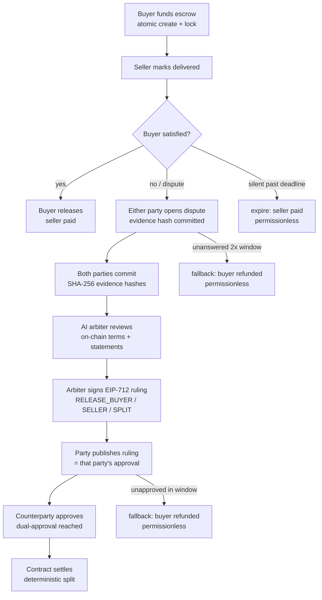
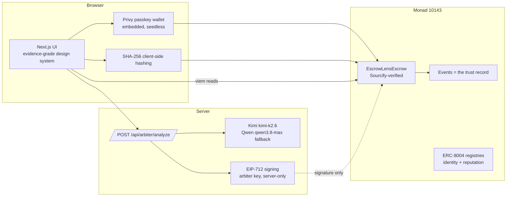

# EscrowLens

**Evidence-grade peer-to-peer escrow on Monad testnet.**
Funds stay locked until both sides agree — or the evidence decides.

EscrowLens locks a payment in a minimal contract. Buyer and seller can always settle by
mutual approval. If they disagree, each side commits **evidence hashes** on-chain and an
independent **AI arbiter** (Kimi K2.6, Qwen fallback) signs an EIP-712 recommendation —
which still requires **both parties** to execute. The arbiter cannot move funds. Nobody
can move funds alone. All timeouts are permissionless, so funds can always be recovered.

- **Live contract:** [`0x11B24EC00A86069fBFbaC6ba20742acdff2B4cB7`](https://testnet.monadexplorer.com/address/0x11B24EC00A86069fBFbaC6ba20742acdff2B4cB7) — Monad testnet `10143`
- **Verification:** Sourcify `exact_match` (job `05eb5677-9da1-40bf-811a-83fd34728db8`)
- **Deploy tx:** [`0x1f86bdb9…0ceb7eb`](https://testnet.monadexplorer.com/tx/0x1f86bdb97e1e333754b80f4e618cdf53e087ac16d08f8312765c1a9680ceb7eb) at block `64,389,959`
- Full evidence table: [`docs/DEPLOYMENTS.md`](docs/DEPLOYMENTS.md)

---

## How it works



**State machine:** `Funded → Delivered → Disputed → RulingPending → Settled`

**Key invariant:** every terminal path requires either (a) the buyer's explicit action,
(b) both parties' approval of an arbiter ruling, or (c) a permissionless timeout that
anyone — never a privileged admin — can trigger. There is no admin key.

## The AI arbiter is an instrument, not a wallet

- Reads the **immutable on-chain terms** (re-read via RPC server-side; client input never trusted)
- Weighs each party's **statement** — plaintext stays in the party's browser, never on-chain
- Emits a **strict-JSON verdict** (ruling type, split, confidence, findings, reasoning);
  malformed output is rejected and the fallback provider is tried
- Signs the verdict with the arbiter key (EIP-712, domain `EscrowLens v1`)
- The contract verifies the signature against the **immutable arbiter address** bound at
  construction, with a per-escrow **nonce + hash replay guard**
- **No function exists** for the arbiter to move funds. Its recommendation is executed
  only when a party records it AND the counterparty approves.

## Architecture



The explorer and dashboard are **derived entirely from contract events** since the deploy
block — no off-chain index, nothing to trust but the chain.

## Quickstart

```bash
# 1. Contract + tests (Foundry)
forge test                      # 31/31 pass

# 2. Web app
cd web
cp .env.example.local .env.local  # or set the vars below
npm install
npm run dev                     # http://localhost:3000
```

Environment (`web/.env.local`):

| Variable | Purpose | Secret? |
|---|---|---|
| `NEXT_PUBLIC_MONAD_RPC` | RPC (default `https://testnet-rpc.monad.xyz`) | no |
| `NEXT_PUBLIC_CHAIN_ID` | `10143` | no |
| `NEXT_PUBLIC_ESCROW_CONTRACT` | deployed contract | no |
| `NEXT_PUBLIC_PRIVY_APP_ID` | passkey wallets ([dashboard.privy.io](https://dashboard.privy.io)) | no |
| `LLM_PROVIDER` | `kimi` (default) or `qwen` | server |
| `KIMI_API_KEY` | [platform.moonshot.ai](https://platform.moonshot.ai), model `kimi-k2.6` | **server-only** |
| `QWEN_API_KEY` | DashScope intl, model `qwen3.8-max` | **server-only** |
| `ARBITER_PRIVATE_KEY` | signs EIP-712 rulings; must equal the contract's `arbiter()` | **server-only** |
| `IPFS_API_KEY/SECRET` | optional encrypted evidence off-chain copy | **server-only** |

`NEXT_PUBLIC_*` values ship in the client bundle by design — never put secrets there.
All server keys stay in Node (API route `src/app/api/arbiter/analyze`); nothing server-side
is exposed to the browser.

## Routes

| Route | Purpose |
|---|---|
| `/` | Mechanism-first landing with live chain counters |
| `/dashboard` | Your obligations: what is waiting on **you**, per escrow |
| `/escrow/new` | Guided transaction construction (parties → deal → terms → review → fund) |
| `/escrow/[id]` | The hero: state rail, evidence ledger, arbitration review, dual approvals, settlement receipt, audit timeline |
| `/escrow/[id]/dispute` | Calm escalation: claim (browser-local) + client-side hashed evidence |
| `/arbiter` | Arbitration review console over disputed escrows |
| `/explorer` | Trust-record search over real contract events |
| `/agent` | Arbiter identity on the ERC-8004 registries (facts only) |

## Testing

```bash
forge test --summary   # 31 tests: lifecycle, tampering, replay, reentrancy, timeouts
```

Coverage highlights: create/revert matrix · evidence binding into rulings · tampered
ruling data · wrong arbiter signature · expiry · cross-escrow replay · split math ·
submitter-auto-approval · stranger rejection · post-settlement revert · approval window ·
three timeout fallbacks · reentrancy attack with funds-intact assertion.

E2E against the live chain: `web/scripts/e2e-lifecycle.mjs` (see `docs/DEPLOYMENTS.md`).

## Security

**Threat model — who can do what:**

| Actor | Can | Cannot |
|---|---|---|
| Buyer | release, dispute, evidence, publish ruling (= self-approval), approve | move funds alone after dispute |
| Seller | mark delivered, evidence, approve | touch funds before release/approval |
| Arbiter (AI) | sign one recommendation per escrow nonce | **move funds — no code path exists** |
| Anyone | trigger timeouts (permissionless) | cancel, censor, or redirect settlements |
| Contract owner | **does not exist** | — |

**Design decisions:**

- **Dual-party approval** — a ruling executes only when both parties approve; the
  publishing party auto-approves (their tx is their signature of consent).
- **Replay protection** — per-escrow ruling nonce + `usedRulingHash`; the same signature
  can never be recorded twice, on any escrow.
- **Evidence privacy** — only SHA-256 hashes touch the chain; plaintext claims stay in
  the party's browser and are shared with the arbiter at review time. IPFS copy is
  optional and never blocks the flow.
- **Immutable arbiter** — bound in the constructor, verifiable on-chain via `arbiter()`;
  signatures are domain-separated (name, version, chainId, contract address).
- **Reentrancy** — `ReentrancyGuard` on every payable path; payouts use low-level calls
  with an explicit `TransferFailed` error.
- **No admin keys** — no owner, no pause, no upgrade. Parameter changes are impossible
  post-deploy; a new deployment would be a new, separate contract.

**Known limitations (honest scope):**

- Native MON only (no ERC-20) — frozen scope for the MVP.
- Evidence hashes prove *commitment*, not ground truth; the arbiter weighs party
  statements as claims. Confidence is the model's own, not a guarantee.
- Statements are browser-local: clearing storage loses them (by design for privacy).
- The arbiter's LLM provider is a centralized service; its *power* is bounded by the
  contract, so compromise yields bad advice — not bad settlements.
- Demo-era testnet deployment; do not move real value on testnet.

## Deployment record

See [`docs/DEPLOYMENTS.md`](docs/DEPLOYMENTS.md) for addresses, tx hashes, block, and
verification evidence. Re-deploy: `forge script script/Deploy.s.sol --rpc-url $RPC --broadcast`.

## License

MIT
